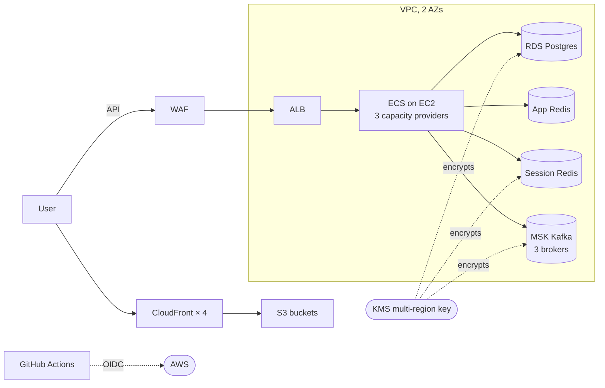

# aws-production-platform-cdk

[](https://github.com/talhariaz324/aws-production-platform-cdk/actions/workflows/cdk-validate.yml)
[](LICENSE)
[](.nvmrc)
[](package.json)

Production-grade AWS infrastructure blueprint for a multi-service backend platform — written in **AWS CDK (TypeScript)**. Demonstrates the patterns and trade-offs senior engineers reach for when running real workloads on AWS at small-team scale: VPC + ECS + RDS + MSK + CloudFront + KMS + OIDC CI/CD, with **cost optimization, scaling levers, and forensic incident walkthroughs documented inline**.

This is a teaching architecture. Every choice has a documented "why," its trade-off, and a concrete trigger for when to reconsider it.

---

## What's in here

| | What | Where |
|---|---|---|
| **5 CDK stacks** | VPC + KMS + IAM (Foundation), RDS + Redis + MSK (Data), ECS + ALB + ECR (App), CloudFront + S3 (Frontend), CloudWatch + WAF (Observability) | `cdk/lib/` |
| **Cost playbook** | $830-940/mo illustrative breakdown, 10× and 100× projections, deferred-lever triggers | `docs/cost-optimization.md` |
| **Forensic incidents** | 3 production incidents debugged and fixed, with root-cause walkthroughs | `docs/incidents.md` |
| **Architecture deep-dive** | Mermaid topology, bounded contexts, region/account strategy, 5-layer backup design | `docs/architecture.md` |
| **Interview defense** | Direct answers to common senior-interviewer questions about every choice | `docs/interview-defense.md` |
| **CI workflow** | `cdk synth` + lint + typecheck on every PR | `.github/workflows/` |

---

## Architecture at a glance



**Stack split** (foundation → data → app/frontend/observability) means data-tier changes, app deploys, and alarm changes are all independent blast radii.

---

## Cost: ~$830-940/mo at small-team scale

| Bucket | $ | Why |
|---|---|---|
| Compute (ECS + Fargate + staging) | $180-200 | 4 ASGs sized by workload class — singletons get dedicated hosts |
| Database (RDS) | $150 | Single-AZ at launch; Multi-AZ deferred until revenue |
| Cache (Redis ×2) | $45 | Two clusters with different durability profiles |
| Event streaming (MSK) | $240 | 3 brokers — minimum for RF=3 with one broker tolerable |
| Networking | $150-170 | 2 NAT gateways (one per AZ) + ALB + VPC endpoints |
| S3, CloudFront | $15-30 | PriceClass 100 saves ~30% vs. global |
| Security (WAF/KMS/Secrets/CloudTrail) | $15 | One CMK for everything, AWS-managed WAF rules |
| Backups | $15-30 | 5-layer defense: RDS auto + Backup vault + pg_dump + CRR + Glacier |
| Observability | $15-25 | CloudWatch + Performance Insights, Datadog deferred |

**Sub-linear scaling.** At 10× users, the bill grows to ~$1,500-1,800/mo (1.7× cost for 10× traffic). Most line items have headroom; shared resources absorb growth.

Full breakdown including deferred levers and triggers: [`docs/cost-optimization.md`](docs/cost-optimization.md).

---

## Why each choice

These are the questions an interviewer or CTO will ask. Short answers here; defended in full in [`docs/interview-defense.md`](docs/interview-defense.md).

| Choice | Why | Why not the alternative |
|---|---|---|
| **ECS on EC2** | Steady-state workload, capacity providers map to workload classes | Fargate is ~30% more expensive at sustained load; EKS premium isn't justified at small scale |
| **Single-AZ RDS** at launch | Multi-AZ doubles RDS cost (~$150/mo) | Pre-revenue, AZ-failure rate (~0.1%/yr) doesn't justify the recurring cost |
| **MSK Kafka** | Durable replayable log + per-key ordering + multi-consumer | SNS+SQS lacks Kafka-style long-lived replay; SQS FIFO has throughput limits |
| **ALB and RDS** | ALB spans 2 AZs; RDS Multi-AZ standby is deferred until revenue/availability trigger, NAT-per-AZ pattern | 3rd AZ adds NAT (~$33/mo) for marginal gain pre-scale |
| **Single AWS account** | Strict IAM + resource policies cover the threat model | Multi-account adds CDK pipeline complexity; right answer at SOC 2 trigger |
| **CloudWatch over Datadog** | $15-25/mo vs. $200+/mo at small scale | Datadog UX is better; revisit at 10× or when distributed tracing is critical to MTTR |
| **OIDC for CI auth** | No long-lived AWS keys in GitHub | GitHub repository secrets are a credential rotation hazard |
| **Capacity provider per workload class** | Singletons get dedicated hosts; ECS placement constraints + desired count protect singleton workloads | Single ASG would let ECS schedule a singleton on any host with capacity |

---

## Production incidents — what actually broke

Three incidents documented in [`docs/incidents.md`](docs/incidents.md), each with symptom, root cause, and lessons:

1. **App stack stuck in `UPDATE_ROLLBACK_FAILED`** — long `onModuleInit` blocked HTTP listener bind + ENI exhaustion compounded; recovered via `continue-update-rollback --resources-to-skip`
2. **Cross-region S3 replication of KMS-encrypted objects** — required a 3-way IAM dance crossing region boundaries via `kms:ViaService`
3. **CloudFront 403 after upstream change** — error TTL prolonged the outage 5 min beyond the actual fix; cache invalidation now part of the rollback playbook

Common thread: **most AWS incidents live at the boundary between services, not inside one service.** Read the docs on the boundary, not the docs on the service.

---

## Repo layout

```
aws-production-platform-cdk/
├── cdk/
│   ├── bin/
│   │   └── app.ts                  # CDK app entrypoint
│   └── lib/
│       ├── foundation-stack.ts     # VPC, NAT, endpoints, SGs, KMS, OIDC
│       ├── data-stack.ts           # RDS, Redis ×2, MSK, Secrets
│       ├── app-stack.ts            # ECS cluster, ECR, ASGs, ALB
│       ├── frontend-stack.ts       # S3 + CloudFront × 4
│       └── observability-stack.ts  # CloudWatch alarms, WAF, log retention
├── docs/
│   ├── architecture.md             # Mermaid topology + stack rationale
│   ├── cost-optimization.md        # $/mo breakdown + deferred levers
│   ├── incidents.md                # 3 forensic walkthroughs
│   └── interview-defense.md        # Q&A on every architectural choice
├── .github/workflows/
│   └── cdk-validate.yml            # synth + lint + typecheck on every PR
├── cdk.json
├── package.json
├── tsconfig.json
├── .eslintrc.json
└── LICENSE
```

---

## Local development

```bash
# requirements
node --version           # >= 20
npm --version            # >= 10
npx cdk --version        # >= 2.140

# install
npm install

# synth all stacks (no deploy)
npm run synth

# diff against deployed stacks (requires AWS creds)
npm run diff

# lint + type check
npm run lint
npx tsc --noEmit
```

## Deploy (against your own AWS account)

```bash
# Bootstrap CDK in your account/region (one-time)
npx cdk bootstrap aws://<ACCOUNT>/<REGION>

# Deploy all stacks
npm run deploy

# Destroy when done (RDS + S3 buckets are RETAIN — manual cleanup)
npx cdk destroy --all
```

**Before deploying**, edit `cdk/lib/foundation-stack.ts` and replace the OIDC role's `sub` claim placeholder with your repo and branch:

```ts
'token.actions.githubusercontent.com:sub': 'repo:<github-org>/<backend-repo>:ref:refs/heads/main',
```

---

## What this blueprint deliberately does NOT include

- **Application code** — this is infrastructure. See [`event-driven-payment-system`](https://github.com/talhariaz324/event-driven-payment-system) for a companion repo with NestJS services, Kafka producer/consumer, outbox pattern, and dockerized local dev.
- **Pre-deployed staging environment** — would double cost. CI synth catches most CDK errors; staging trade-off documented in interview-defense.md.
- **Multi-account architecture** — premature pre-revenue. Listed as deferred work with SOC 2 trigger.
- **Observability stack (Datadog/Honeycomb)** — listed as deferred work; CloudWatch covers ~80% at <10% the cost.
- **Spot instances for ECS** — services need graceful SIGTERM handling first. Listed in deferred levers.

## License

MIT
