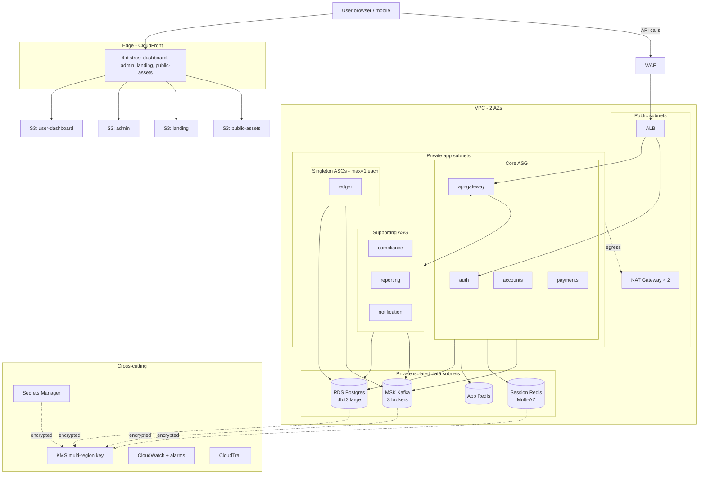

# Architecture

## High-level topology

## Stacks

| Stack | Owns |
|---|---|
| `FoundationStack` | VPC, NAT, VPC endpoints, security groups, KMS, GitHub Actions OIDC role |
| `DataStack` | RDS, ElastiCache (×2), MSK, master credentials in Secrets Manager |
| `AppStack` | ECS cluster, ECR repos, capacity providers (ASGs), ALB, task execution role |
| `FrontendStack` | S3 buckets per app, CloudFront distributions per app, OAI |
| `ObservabilityStack` | SNS alert topic, CloudWatch alarms, WAF v2 ACL, log groups with retention |

Why 5 stacks (not 1, not 12):
- Foundation must deploy before everything else (VPC + KMS are dependencies).
- Data is its own stack because changes here are higher-stakes (deletion protection, snapshot policies) and reviewers approach them differently.
- Frontend is independent of App — frontend deploys don't need backend rollouts.
- Observability is decoupled so alarm changes don't risk app availability.
- More stacks would add cross-stack reference complexity without proportional payoff.

## Bounded contexts and service set

The blueprint uses a sample backend service set (loosely fintech-shaped — adjust to your domain):

| Service | Workload class | Owns |
|---|---|---|
| `api-gateway` | core | Public HTTP edge, request routing, rate limiting per user |
| `auth` | core | User authentication, session issuance, MFA |
| `accounts` | core | User profile, KYC status |
| `payments` | core | Payment intent creation, idempotency keys, status |
| `ledger` | singleton | Double-entry ledger — exactly-one writer for ordered ledger entries |
| `notification` | supporting | Email / SMS / push fan-out from Kafka events |
| `compliance` | supporting | AML, sanctions screening, transaction monitoring |
| `reporting` | supporting | Periodic aggregates, regulatory reports |

`core` services need consistent low-latency response. `supporting` services do batch / async work that can tolerate variable resource contention. `singleton` services have at-most-one semantics — running two copies would corrupt state.

## Region & account strategy

- **Single region (us-east-1) primary.** Multi-region active-active triples cost without proportional reliability gain at small-team scale. Single region with cross-region S3 backup replication for DR.
- **DR region: us-west-2.** Far enough from us-east-1 to survive a regional event. Cold standby — no compute running there until needed.
- **Single AWS account at launch.** AWS Organizations + dev/staging/prod/security accounts are correct at scale, premature pre-revenue. Trigger to split: SOC 2 audit conversation.
- **IAM**: federated developers via SSO (no IAM users), least-privilege roles per service. Production `Administrator` access requires MFA and is logged via CloudTrail.

## Network architecture

- **2 AZs.** Minimum for ALB + RDS Multi-AZ-ready. 3 AZs adds a third NAT (~$33/mo) for marginal gain at small-team scale.
- **3 subnet tiers per AZ:**
  - **Public**: ALB and NAT only.
  - **Private app**: ECS hosts. Egress via NAT.
  - **Private isolated**: RDS + ElastiCache + MSK. No NAT route.
- **2 NAT gateways**, one per AZ. Single NAT would be a single AZ point of failure for all egress.
- **5 VPC endpoints** (S3 gateway + ECR/Logs/Secrets interface) to cut NAT egress cost. Net positive starting around 100GB/mo egress.
- **Security groups as the firewall**, not NACLs. SGs are stateful, identity-based, and easier to reason about in code.

## Data tier

### RDS PostgreSQL
- `db.t3.large`, 100GB gp3 storage, auto-scale up to 500GB.
- **Schema-per-service pattern**: each service owns a schema in one DB instance. Shares infra cost; isolates logically.
- 7-day automated backups + AWS Backup vault (weekly + monthly retention) + nightly logical `pg_dump` to S3.
- Performance Insights enabled — covers most "what's slow" questions without paid APM.
- **Single-AZ at launch.** Documented trade-off; trigger to flip Multi-AZ on is "first revenue cohort."

### ElastiCache Redis (×2 clusters)
- **App Redis**: ephemeral cache. Single node, OK to lose.
- **Session Redis**: durable session store. Multi-AZ failover.
- Two clusters because mixing ephemeral cache and durable sessions in one cluster means either over-paying for cache durability or under-paying for sessions.

### MSK Kafka
- 3 brokers (kafka.t3.small + 100GB EBS each).
- 3 brokers is the minimum for replication factor 3 + `min.insync.replicas=2` — tolerates one broker failure without losing writes.
- Self-managed Kafka on EC2 is ~40% cheaper but operationally toxic (broker upgrades, ZooKeeper coordination, monitoring) — MSK earns its premium.

## Compute tier

### ECS on EC2 with capacity providers (not Fargate, not EKS)

**Why not Fargate**: at sustained workload Fargate costs ~30% more than equivalent EC2 + ECS. The convenience of "no host management" doesn't pay back when you have a stable steady-state workload.

**Why not EKS**: EKS is correct at 50+ services with a platform team. At fewer services, EKS control plane fees + operator burden + ingress controller / cluster autoscaler / RBAC complexity exceeds ECS by a wide margin.

### Capacity provider split by workload class

3 ASGs as capacity providers:

- `core` (t3.medium ×2-6): regular fleet of stateless API services
- `supporting` (t3.small ×2-5): compliance, reporting, batch work
- `singleton` (t3.small ×1, max=1): services that MUST run as exactly one task

The singleton ASG is a structural correctness guarantee: ECS literally cannot place two copies because there's only one host with capacity. The ~$15/mo per singleton is the price of correctness for at-most-one semantics.

## Frontend delivery

CloudFront in front of S3, separate distribution per app:

- **User dashboard** — standard caching policy
- **Admin** — caching disabled (stale UI is dangerous in admin operations)
- **Landing** — aggressive caching (content rarely changes; max cache hits = min S3 costs)
- **Public assets** — separate distribution so a bug or compromise here doesn't affect authenticated traffic

PriceClass 100 (US/EU only) saves ~30% vs. global. HTTP/2 + HTTP/3 enabled. TLS 1.2 minimum.

## Security

- **KMS**: single multi-region CMK for at-rest encryption (RDS, S3, Secrets, MSK). Multi-region replica key in DR region.
- **Secrets Manager**: master DB credentials, third-party API keys. Auto-rotation enabled where supported.
- **WAF v2** on ALB: AWS Managed Common Rule Set + Known Bad Inputs + rate limit (2000 req/5min/IP).
- **CloudTrail**: management events to S3 with 1-year retention + Glacier transition. Lifecycle handles cost.
- **GitHub Actions OIDC**: no long-lived AWS access keys. Tokens bound to repo + branch via `sub` claim, 1-hour expiry.

## Observability

- **CloudWatch** for logs, metrics, alarms. RDS Performance Insights for DB. VPC Flow Logs to S3 for network forensics.
- **Critical alarms**: RDS storage <20GB, RDS CPU sustained >80% for 30min, ALB 5xx >10/min.
- **Alert channel**: SNS topic with email subscription. Easy to upgrade to PagerDuty when on-call rotation lands.
- **Datadog/Honeycomb deferred** — CloudWatch + Performance Insights cover ~80% of the observability surface for ~10% of the cost. Revisit at 10x scale.

## CI/CD

- **GitHub Actions OIDC** to assume an AWS role with minimum scope (ECR push + ECS update-service + CFN describe-stacks).
- **Build → push → ECS rolling deploy** via `update-service --force-new-deployment`. Both `:<sha>` and `:latest` ECR tags pushed for explicit rollback support.
- **Why rolling, not blue/green**: blue/green needs separate target groups + DNS swap, adds CodeDeploy complexity. Rolling is sufficient for minute-level deploys; blue/green wins at scale (instant rollback, zero-downtime guaranteed).
- **CDK deploy on infrastructure changes**, manually triggered for now. Trigger to automate: when CDK diff ergonomics + drift detection are mature enough to remove the human approval step.

## Backup & DR

Five backup layers — defense in depth:

1. RDS automated backups (7-day retention, point-in-time recovery)
2. AWS Backup vault (weekly snapshots / 90-day, monthly snapshots / 1-year)
3. Logical `pg_dump` daily to S3 (defends against logical corruption that snapshots can't fix)
4. S3 cross-region replication of backup bucket (us-east-1 → us-west-2)
5. Glacier transition on backup bucket after 30 days

Layers 1–2 protect against AWS infrastructure failure. Layer 3 protects against logical corruption (snapshot of corrupt DB is still corrupt). Layer 4 protects against region failure. Layer 5 manages cost.

**RTO target**: 2-4 hours from a region failure (cold restore in DR region). **RPO target**: 1 hour.

That's not Netflix-grade. The trigger to add a warm standby in us-west-2 (cuts RTO to ~30 min) is "revenue covers the recurring cost of a warm standby" or "contract requires a tighter RTO."
